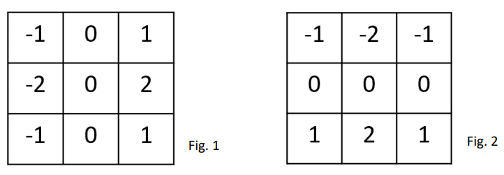
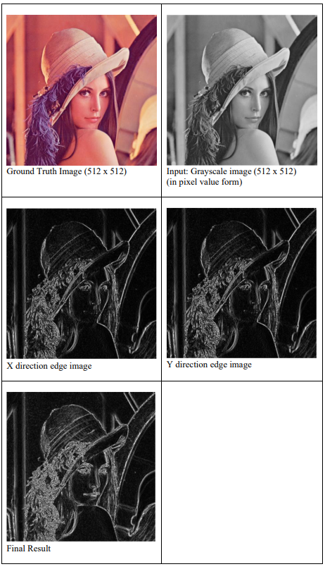
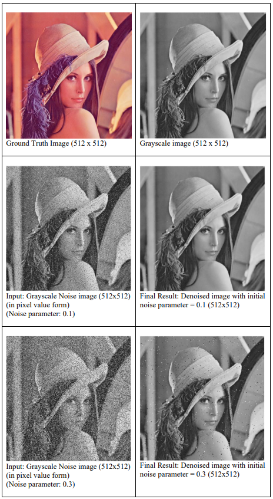
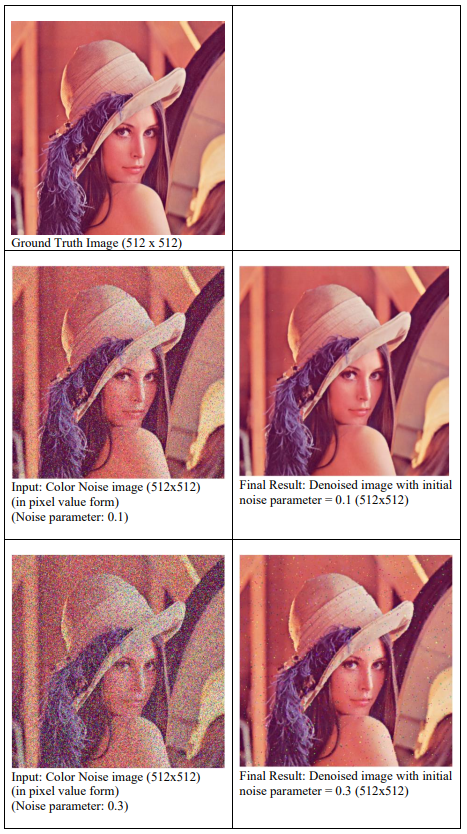

# Image Processing with FPGA
Yih CHENG (https://github.com/chengyih001) 

## Environment
> Xilinx Vivado == 2020.2
>
> FPGA Board : pynq-z2

## Overview
Due to the rapidly increasing research in computer vision, image pre-processing has been one of the most popular focuses in the recent years. With fine tuning of image datasets, it greatly helps when training models and decreasing training duration. This project consists of two parts, with the first part being image edge detection and the second being image denoising. For image edge detection, it comes in handy when dealing with images that require boundaries, for instance auto colorization in deep learning. It can reduce the time of training and provide a somewhat concrete prototype for the model to follow. As for image denoising, it can be used in real time cases such as denoising photos taken on the phone, especially in the night where noise ratio is much higher. Also, it might serve well for image preprocessing of datasets, since denoising the image removes the outliers, and in some cases, it should make training and testing results in deep learning easier.

## Detail Implementation
### Image edge detection : Sobel edge detection algorithm.
For sobel edge detection, we try to find the direction of the largest increase from light to dark, and also the rate change in that direction. Details of the algorithm states that we do element-wise multiplication in both x and y domain over a 3x3 kernel matrix and sum the elements up as the output. This step is performed repeatedly in a convolutional manner over the whole image. As for the result, it shows how smoothly an image changes at a specific region of pixels. If the region is a constant or of similar brightness, it results in a nearly zero vector. If the image changes rapidly in that region, it results in a vector pointing across the edge from the darker side to the brighter side. The vector is then summed up to get an integer for the new pixel value in that specific region, and these new pixels are output in “grayscale” domain after applying the filter to the whole image. The kernel matrix of x and y domain is shown in Fig. 1 and Fig. 2 respectively.

  

### Image denoising : Median filter algorithm
For median filter, convolution is still performed over the whole image, but instead of calculating math over 3x3 kernel matrix, we directly extract the median number of each kernel matrix to represent the new value of that specific region of pixels. In this case, noises are greatly reduced since in most cases, they are much more likely to differ from the average colors in a pixel region. In other words, chances are that noisy pixels are anomalies, and therefore it is quite hard for them to be the median number that will be extracted to form a new image.

## Results

  
  
  

## Implementation
 
Python:   `image_edge_detection.ipynb,   image_denoising.ipynb,   image_denoising_color.ipynb`

    The python files are for visualizing the output pixel arrays.

Verilog: `edge_detection_sobel.v, denoising_median_filter.v, denoising_median_color.v`

    These three files implements the full algorithms in order to achieve the goal of image pre-processing.

Verilog: `testbench_edge_detection.v,  testbench_denoising.v,  testbench_denoising_color.v`

    The testbenches take respective inputs into the models and save the results in the file specified.

In addition, one thing worth noting is that the image size will shrink by two pixels after applying the filters since no padding or striding is introduced. For example, an input image with 512x512 will shrink to 510x510 after applying the filter. This is due to the convolutional manner implemented, and can be solved through padding and striding during pre-implementation of the modules if needed.
